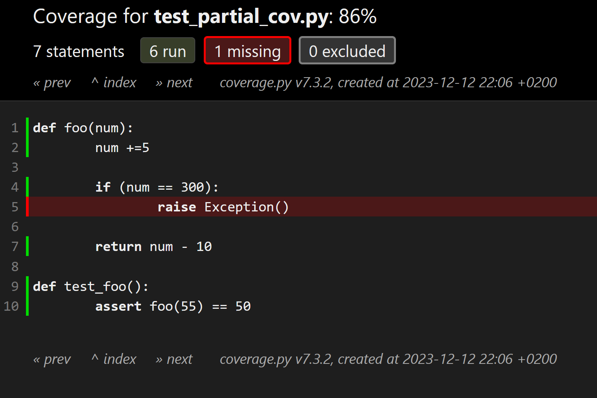

# How do I know if my code even works?

---

# Software testing in Python with Pytest

- About me:

    - Eli Boyarski, almost Ph.D 
        - eli@boyar.ski
        - @EliBoyarski on Twitter
        - github.com/eli-b

    - TA'ed some courses in BGU
    
    - Industry background as a software engineer, writing C++ and Python

---

# Ways to know my code works

- *Builds successfully* with no warnings (Python?)

- *Static analysis tools* - strongly recommended, out of scope today

- *Algorithm has a proof* - does you implementation have a proof?

- **Testing - today's focus**

- *Code review* - strongly recommended, but should be done after code is tested

- *A lot of people use it* - a rich person's problem...

---

# Why test?

- "My company doesn't sell tests"
    - But it does sell safety, correctness, quality, ...

- Testing is always part of your job, part of your craftsmanship as a coder
    - NOT somebody else's job to make sure your code works!

- ***If it's not tested it's broken***
    - Especially true for Python code

---

# Why test? (cont.)

- Having a good test suite enables you to go FASTER
    - You're less afraid of breaking things

- Your colleagues will like you more!
    - Taking over code that has a good test suite is much nicer. 

- Code without tests has a higher likelihood of being thrown away

- Testing improves the design of your system
    - Identifies unclear specs
    - Tests are easier to write when APIs are simple and components are decoupled - writing tests forces you to improve!

---

# What should we test?

- Every single line of code in your company?
    - Not even as an aspiration
    
- A script that would only be run once?
    - Certainly, if you run it on your production server
    
- Your test code itself?
    - More on that later

--- 

# Exercise 1: Coming up with tests

Function to test:

    !python
    def make_phonebook(entries, config):
    """Break list of phone numbers into pages
    for printing in a physical phonebook"""

---

# Types of tests

- Correctness tests
    - Sanity
    - Edge cases
    - Error handling

- Performance tests

- Stress/load tests

- ...

---

# Integration tests

- Pros:
    - A lot of bugs appear where multiple modules interact.
    - The ratio between the size of the test code and tested code is usually better than in unit tests.

- Cons:
    - Integration tests are harder to maintain - they require more components to stay unchanged.
    - Integration tests take longer to run.

---

# Writing test cases/scenarios

- Every test case should test for exactly one thing
    - Otherwise, when the test fails - what broke?
    - I want to know what went wrong from the name of the test
    
- Every bug we discover should have a test added for it.
    - Otherwise, how do we know it was fixed?
    - Existing tests did not catch the bug
    - Helps catch regressions

---

# Whitebox vs blackbox test cases

- Blackbox tests don't make assumptions about the code of the system
    - Generally try to write all your test cases this way

- Whitebox tests are written with the code of the system in mind
    - More prone to break when the code changes

---

# Automatic vs manual testing

- Automate all tests?

- Some test cases are easier to implement as code, some are easier to perform manually

- Both have pros and cons. Can you think of some?

- Can we automatically test that error messages are clear?

- Can we automatically test that the code is readable?

- Can we test for everything manually?
    - Automatic tests can test the impossible

---

# Arrange-Act-Assert

	!python
	# Arrange
	account = Acount('Jane Doe', balance=100)
	
	# Act
	account.withdraw(10)
	
	# Assert
	assert account.balance == 90
    
- Structure helps clarity
- Helps against the *"blank page syndrome"*
- a.k.a. Given-When-Then

---

# Pytest

Pytest is Python's de-facto standard testing framework.
Handles test discovery, execution, and reporting, with an extensive plugin library.

example.py:

    !python
    def add(a, b):
        return a + b

test_example.py:

    !python
    from example import add
    
    def test_add():
        assert add(1, 2) == 3

No boilerplate!

---

# Pytest (cont.)

Collect and run tests:

    $ pytest
    ======================== test session starts ========================
    platform win32 -- Python 3.12.0, pytest-7.4.3, pluggy-1.3.0
    rootdir: C:\Users\eli\testing-talk
    configfile: pyproject.toml
    .                                                              [100%]
    ========================= 1 passed in 1.57s =========================

    
---

# Pytest (cont.)

- Test file names start with "test_"
- Test function names start with "test_"
- A test that throws an exception is considered failed
- A test that doesn't - passes
    - Always test that your test CAN fail! Forget to assert and the test will always pass.
- Tests should clean up after themselves - e.g., delete temporary files
    - Helps both the next test we run and the next execution of the same test.
    
---

# Pytest (cont.)
    
How do we verify code that is *supposed* to throw an exception?

    !python
    def divides_by_zero():
        return 1 / 0
    
    def test_divides_by_zero():
        with pytest.raises(ZeroDivisionError):
            1 / 0

Working with floats:

    !python
    assert 0.1 + 0.2 == 0.3  # Fails :(
    
    assert abs((0.1 + 0.2) - 0.3) < 1e-6  # Passes but uses a hard-coded tolerance and is easy to get wrong
    
    assert 0.1 + 0.2 == pytest.approx(0.3)  # Passes :)
  
---  
 
# Pytest (cont.)

Easy to test returned values. How do we test this function?

    !python
    def say_hello(name):
        print(f'Hello, {name}!')
  
---  
 
# Pytest (cont.)

Fixtures are objects that provide capabilities to tests.
To request a fixture, just add its name as a parameter (magic!).
`capsys` is a built-in fixture:

    !python
    def test_say_hello(capsys):
        # Arrange
        name = Guido
        
        # Act
        say_hello(name)
        
        # Assert
        captured = capsys.readouterr()
        assert captured.out.strip() == 'Hello, Guido!'

---

# Exercise 2: Writing tests with Pytest

Let's test these functions!

    !python
    def pi(digits):
        """Return `digits` digits of pi, in clumps of 40. Only accepts values between 1 and 1000."""

    def is_prime(n):
        """Return whether n is prime, only accepts integers larger than 0."""

    def prime(n):
        """Return the n'th (1-based) prime, n between 0 and 1000"""

    def fibonacci(n):
        """Return the n'th (1-based) item in the Fibonacci series, n between 1 and 1000"""

---

# Mocking

Here's an example of code which is hard to test:

	!python
	def log(data):
		try:
			with open("log", "a") as f:
				f.write(data)
            return True
		except IOError as e: # hard drive full
			if e.errno == errno.ENOSPC:
				return False
                
---

# Mocking (cont.)

`unittest.mock` is a built-in library that creates "fake" objects with the same interface as another class.
Mock objects are often used in tests to simulate the external dependencies that the tested code interacts with.

`unittest.mock` also support "Monkey Patching", the process in which we replace objects that the tested code
interacts with with other objects, often mock objects. In my experience, this is delicate and error-prone.

In my experience, tests that use mock objects tend to be very whitebox-style,
and are often brittle (break with minor changes to the tested code).

                
---

# Mocking (cont.)

Here's how we use mocking to test the log example:

    !python
    import unittest.mock
    
    def test_log(self):
        with unittest.mock.patch('__builtin__.open') as open_func:
            assert log("foobar") == True
            open_func.return_value.write.assert_called_with("foobar")
            
    def test_log_no_space(self):
        with unittest.mock.patch('__builtin__.open') as open_func:
            error = IOError()
            error.errno = errno.ENOSPC
            open_func.side_effect = error
            assert log("foobar") == False

---

# Continuous integration (CI)

- All code hosting solutions can run code automatically when a new commit is pushed
    - A.k.a. GitHub Actions, BitBucket Pipelines, ...
    - Use them to run tests!
    
- It's free compute! <meme\>

- A central location for running tests. No more "the tests passed on my machine".
    
- Most importantly, it gives your repository cool badges! :)

- Check out later how I set it up in my `testing-talk` GitHub repository

---

# Test Coverage

`Coverage.py` measures code coverage of Python programs.
`pytest-cov` is a Pytest plugin that creates a nice report
from your test execution that shows exactly which lines of code were tested.

This helps identify untested code. Ideally, you should aim for maximal code coverage.
This is especially true in Python, where there is no compiler to validate your type system.

codecov.io is a service that your CI can send the raw coverage data to and create a cool badge for your project.

---

# A software tester walks into a bar

Runs into a bar.
Crawls into a bar.
Dances into a bar.
Flies into a bar.
Jumps into a bar.

And orders:
a beer.
2 beers.
0 beers.
99999999 beers.
a lizard in a beer glass.
-1 beer.
"qwertyuiop" beers.

Testing complete.

A real customer walks into the bar and asks where the bathroom is.

The bar goes up in flames.

---

# Property-Based Testing with Hypothesis

Instead of testing with a few specific examples of data, Property-Based Testing lets you 
test on all data that matches the required specification.

Hypothesis does three cool things:

- It runs your test with many instances of arbitrary data that matches your spec, e.g. integers between 3 and 1000.
- It uses established testing practices for choosing the examples: values that are just beyond and just within the bound, very large values, etc.
- If it finds an example that fails the test, it automatically simplifies it to the simplest and shortest example that still fails the test.
E.g., if a test failed with a string that 10,000 characters long, Hypothesis can report find and report the shortest string that still failed the test,
which may be only 10 characters long and would be much nicer to debug.

It's how I write tests.

---

# Hypothesis demo

From test_example2_with_hypothesis.py:

    !python
    @given(n=integers(min_value=2, max_value=1000000))
    def test_is_prime_nominal(n):
        """Tests integers within the accepted range"""
        ret = example2.is_prime(n)
        assert ret == (n in primes_set)

---

# Where to go from here

- Go write tests for your project or for a homework assignment you wrote

- Explore my testing-talk repository: [https://github.com/eli-b/testing-talk](https://github.com/eli-b/testing-talk)

- Read a guide from Pytest's great documentation [https://docs.pytest.org/en/latest/index.html](https://docs.pytest.org/en/latest/index.html)

- Listen to an episode of the Python Test podcast. [This one](https://podcast.pythontest.com/episodes/10-test-case-design-using-given-when-then-from-bdd) covers Given-When-Then.

- Read the Hypothesis documentation: [https://hypothesis.readthedocs.io/en/latest/](https://hypothesis.readthedocs.io/en/latest/)

- Follow [@pytestdotorg](twitter.com/pytestdotorg), [@brianokken](twitter.com/brianokken), [@KentBeck](twitter.com/KentBeck), and other testing personalities on Twitter

- Share your testing experiences!

---

# Q&A

